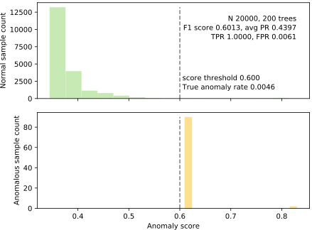

# Anomaly Detection with Isolation Forest Algorithm

The goal of this project was to implement the Isolation Forest algorithm as defined in [this paper](https://github.com/skhaniyur/iforest-anomaly-detection/IsolationForestPaper.pdf) from scratch.

**Main Idea**

- Anomalies are few and different. We want to explicity isolate anomalies rather than construct a profile of normal instances.
- With many iterations, we can start to see which data points are consistently different than others to isolate the anomalies.
- This algorithm has a linear time complexity with a low constant, and it requires less memory.

**About the Algorithm**

- For a dataset, we construct a binary tree with it by splitting at random variables and values.
- Anomalies are more susceptible to isolation, so they end up closer to the root of the tree. Normal points are isolated deeper in the tree.
- By creating an ensemble of these random trees, we can average the height of each instance. Anomalies will have a shorter average path length than normal points.

**Improving the Algorithm**

If the dataset is very large, the trees could grow wider and deeper which may make the anomalies not distinct from the normal points. This affects speed and increases noise sensitivity.

To improve the algorithm, here are some ideas:

- I chose to simply limit the number of instances that could be in a leaf node to prune each tree.
- The authors suggest computing and sorting by feature kurtosis then using a subset of those features during training.
- You can try using [dask](https://github.com/dask/dask) or [Python 3's multiprocessing](https://docs.python.org/3/library/multiprocessing.html).

## Code & Usage

**Datasets**

- [Kaggle credit card fraud competition data set](https://www.kaggle.com/mlg-ulb/creditcardfraud)    
- Get cancer data into `cancer.csv` by executing [savecancer.csv](https://github.com/parrt/msds689/blob/master/projects/iforest/savecancer.py)
- [http.zip](https://github.com/parrt/msds689/blob/master/projects/iforest/http.zip); download, unzip to get `http.csv`

**Requirements**

- numpy
- pandas
- sklearn

**Usage**

Run the `score.py` file with `-noise` and `-improved` flags. 

This script was given by Professor [Terence Parr](https://github.com/parrt) of USF, and it tests for True Positive Rate (TPR), False Positive Rate (FPR), and fit time across the three labeled datasets.

## Visualizations of Anomaly Separation

<table border="0">
<tr><td>http.csv, 200 trees, 99% desired TPR</td></tr>
<tr>
<td border=0>

</tr>
</table>

<table border="0">
<tr><td>creditcard.csv, 200 trees, 80% desired TPR</td><td>creditcard.csv, 200 trees, 90% desired TPR</td></tr>
<tr>
<td border=0>

<td border=0>

</tr>
</table>

<table border="0">
<tr><td> cancer, 300 trees, 70% desired TPR</td><td> cancer, 300 trees, 80% desired TPR</td></tr>
<tr>
<td border=0>

<td border=0>

</tr>
</table>

## Algorithm

Algorithms extracted from the Liu *et al* paper:

<table border="0">
<tr>
<td width="50%" valign="top"></td><td width="50%" valign="top"></td>
</tr>
<tr>
<td valign="top">

</td>
<td valign="top">
Please use this version of average path length <tt>c()</tt>, not the one in the original paper: 

Then finally here's the scoring formula: 

where "<i>H(i)</i> is the harmonic number and it can be estimated by <i>ln(i)</i> + 0.5772156649 (Euler’s constant)."
</td>
</tr>
</table>

## Credits

- MSDS689 Class Project given by Professor [Terence Parr](https://github.com/parrt). Thank you for the materials!
- Authors of the Isolation Forest paper: Fei Tony Liu, Kai Ming Ting, and Zhi-Hua Zhou

